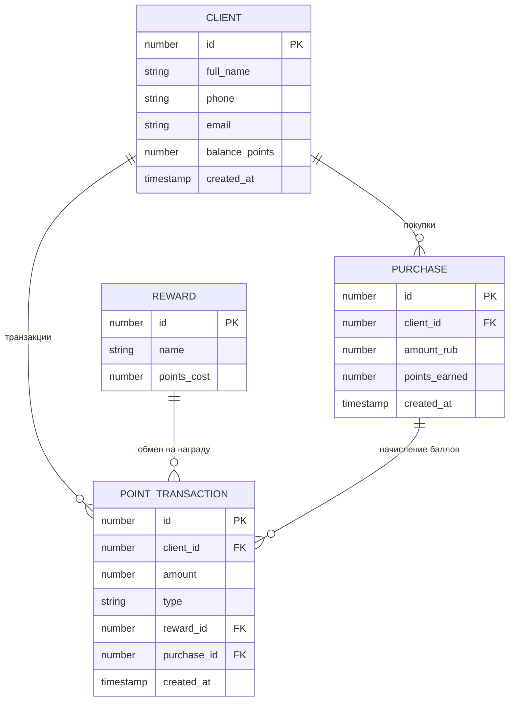

# Схема БД

## Диаграмма

## Таблицы

- **CLIENT** — клиенты: id, full_name, phone, email, balance_points, created_at
- **REWARD** — справочник наград: id, name, points_cost
- **POINT_TRANSACTION** — транзакции баллов: id, client_id, amount, type (PURCHASE/REWARD), reward_id (nullable), purchase_id (nullable), created_at
- **PURCHASE** — покупки: id, client_id, amount_rub, points_earned, created_at

## Связи

- CLIENT.id → POINT_TRANSACTION.client_id (FK)
- CLIENT.id → PURCHASE.client_id (FK)
- REWARD.id → POINT_TRANSACTION.reward_id (FK, nullable)
- PURCHASE.id → POINT_TRANSACTION.purchase_id (FK, nullable)

## Представления

- **v_client_stats** — клиенты с количеством покупок и датой последней покупки
- **v_point_transaction_detail** — транзакции баллов с именем клиента и названием награды
- **v_reward_usage** — награды и количество обменов по каждой
