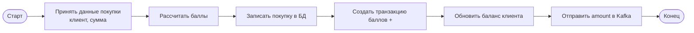
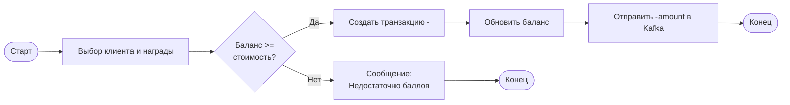
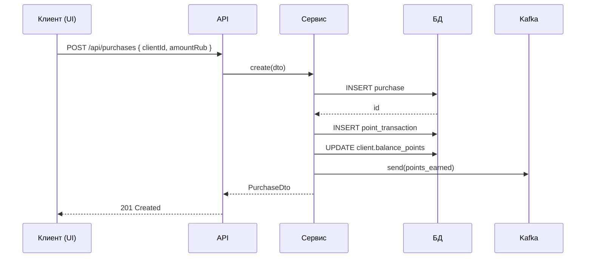
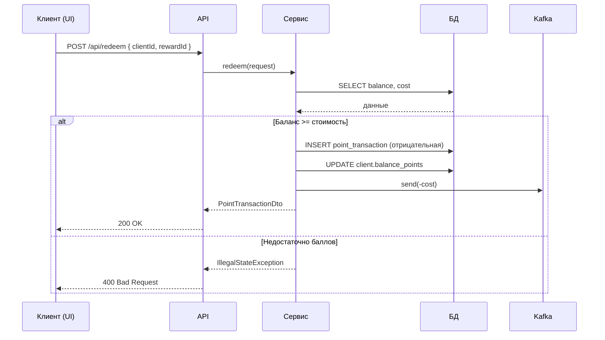

# BPMN и Sequence диаграммы по ТЗ

Диаграммы построены на **Mermaid**

---

## BPMN: Регистрация покупки и начисление баллов

---

## BPMN: Обмен баллов на награду

---

## Sequence: Регистрация покупки

---

## Sequence: Обмен баллов на награду

---
